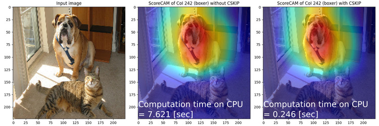
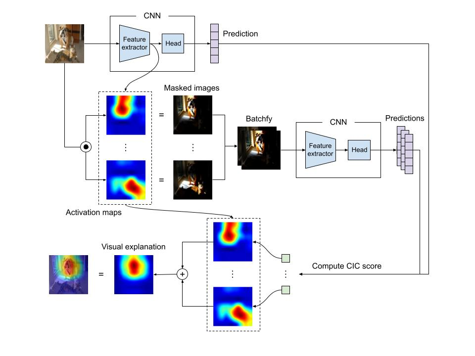
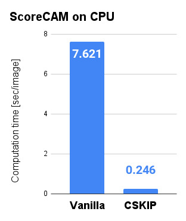
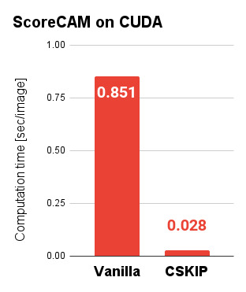

PyTorch implementation of Score-CAM
================================================================================

This repository provides an unofficial PyTorch implementation of Score-CAM [1].
Score-CAM is a CAM (class activation mapping) [2] based visual explanation
method like Grad-CAM [3] and Grad-CAM++ [4], but Score-CAM does not depend on
gradients and can provide stable visual explanations. The code of this
repository also contains additional functions, like CSKIP. See the following
sections for more details about the additional functions.

The features of this implementation are:

* **Versatile**: The code of this repository is applicable to many types of
  neural networks, not only for the models provided by `torchvision` module
  but also for custom CNN models.
* **Portable**: This repository is easily transplanted to user projects.
  At this moment what the users need to do is just copy a single Python file
  to the user's projects.
* **Less dependent**: The core module of this repository has fewer dependencies
  for easier transplantation to user's projects. The current implementation
  depends only on `numpy` and `torch` module.

<div align="center">
  
</div>


Installation
--------------------------------------------------------------------------------

The core module of this repository, `scorecam`, requires only NumPy and PyTorch.

```console
pip3 install numpy torch
```

Additionally, the example code `examples.py` requires OpenCV, Matplotlib
and Torchvision.

```console
pip3 install opencv-python matplotlib torchvision
```


Usage
--------------------------------------------------------------------------------

### Minimal example

```python
import numpy as np
import cv2 as cv
import torchvision

# Import ScoreCAM class.
from scorecam import ScoreCAM

# Load NN model.
model = torchvision.models.resnet18(weights="IMAGENET1K_V1")

# Load input image.
image = cv.imread("resources/sample_image_01.jpg", cv.IMREAD_COLOR)
image = cv.cvtColor(image, cv.COLOR_BGR2RGB)
image = cv.resize(image, (224, 224), interpolation=cv.INTER_CUBIC)

# Normalize the image.
IMAGENET1K_MEAN = np.array([0.485, 0.456, 0.406])
IMAGENET1K_STD  = np.array([0.229, 0.224, 0.225])
x = (image / 255.0 - IMAGENET1K_MEAN) / IMAGENET1K_STD

# Create Score-CAM instance.
scorecam = ScoreCAM(model, actmap="layer4")

# Compute visual explanation.
# The argument 'coi' means 'class of interest' and the number 242
# is the index of the label 'boxer' (breed of dog) in ImageNet.
L = scorecam.compute(x, coi=242)
print(L)
```

### Custom scoring function

If your CNN model is not a classification network, the class of interest
does not make sense and you need a custom function for scoring in Score-CAM.
In such case, you can specify a Python function to the argument `coi`.

For example, imagine that your CNN is YOLO and outputs a tensor with shape
(B, 5 + C, H, W) where B is a batch size, C is a number of class, and
(H, W) is an output resolution. If you want to analyze the detection result
of class `C = c` at `H = h` and `W = w`, the custom function can be written
like the following:

```python
# Define a custom scoring function.
coi_fn = lambda output: output[:, c, h, w]

L = scorecam.compute(x, coi=coi_fn)
```

Note that the following code

```python
L = scorecam.compute(x, coi=target_index)
```

is equevarent with

```python
# Define a scoring function.
coi_fn = lambda output: output[:, target_index]

L = scorecam.compute(x, coi=coi_fn)
```

where `target_index` is an integer.


What's the ScoreCAM?
--------------------------------------------------------------------------------

ScoreCAM is a CAM-based method to compute visual explanations for CNN.
The other CAM-based methods depend on the gradient of the output of CNN,
but ScoreCAM does not.
ScoreCAM scores each channel of the activation map by the prediction result of
a masked image which is defined as the Hadamard product of the input image and
a channel of activation map.
The following figure is a sketch of ScoreCAM procedure.

<div align="center">
  
</div>


Additional function 1: CSKIP (channel skipping)
--------------------------------------------------------------------------------

### Background

One of the weak points of ScoreCAM is inference speed. Normally ScoreCAM is
much slower than other CAM-based methods like GradCAM or GradCAM++.
It is considered a tradeoff of inference stability, but we can accelerate
the computational time of ScoreCAM by a very simple trick.
A cause of the long computation time is that ScoreCAM requires many forward
inferences to compute the output visual explanation.
For example, if the number of channels of the activation map is 512, then
forward inference of 512 images is required.

### Method

However, we can easily imagine that a only very limited number of channels of
the activation maps contribute to the output visual explanation.
This means that we can reduce the computational time of ScoreCAM by omitting
"unnecessary" activation maps from the calculation of the visual explanation.
Although there may be many ideas on how to measure the "necessity" of each
channel of the activation map, in this repository, we use the maximum value
of each channel as a measure of necessity.

So the acceleration procedure is summarized like the following:

* Get an activation map from the input image,
* Sort the channel of the activation map by the maximum value of each channel,
* Keep only top `K` channels and drop other channels from the activation map,
* Compute ScoreCAM visual explanation using the reduced activation map,

where `K` is a hyperparameter. We call this method as CSKIP (Channel SKIPping).

### How to use

You can easily apply CSKIP by adding `cskip=True` and `sckip_out=K` to the
argument of the function `ScoreCAM.compute`, like the following:

```python
L = scorecam.compute(x, coi=242, cskip=True, cskip_out=16)
```

The hyperparameter K controls the ratio of acceleration.
If the channel number of the activation map is 512 and the number of remaining
channels K is 16, then you can expect 32 (= 512 / 16) times faster inference.

### Numerical results

The following is the experiment results on the author's environment
with the following settings:

* pre-trained model: ResNet18 trained on ImageNet V1
* The layer to extract the activation map: `layer4`
* input image: `resources/sample_image_01.jpg`
* Class of interest: 242 (boxer)
* Number of channels to be kept on CSKIP: 16

As you can see, the visualization result of ScoreCAM with CSKIP is almost
the same as the visualization without CSKIP, however, the computational time
is much faster.

<div align="center">
  
</div>

<div align="center">
  
  
</div>

| Device     | Vanilla           | SCKIP             | Acceleration ratio |
|:----------:|:-----------------:|:-----------------:|:------------------:|
| CPU        | 7.621 [sec/image] | 0.246 [sec/image] | x 30.98            |
| CUDA (GPU) | 0.851 [sec/image] | 0.028 [sec/image] | x 30.32            |

Note that the experiment environment is:

* CPU: Intel(R) Core(TM) i5-9300H CPU @ 2.40GHz
* RAM: 32GB
* GPU: NVIDIA GeForce GTX 1660 Ti


References
--------------------------------------------------------------------------------

[1] H. Wang, Z. Wang, M. Du, F. Yang, Z. Zhang, S. Ding, P. Mardziel, and X. Hu,
    "Score-CAM: Score-weighted visual explanations for convolutional neural networks",
    CVPR, 2020. [URL](https://arxiv.org/abs/1910.01279)

[2] M. Oquab, L. Bottou, I. Laptev, J. Sivic,
    "Is Object Localization for Free? - Weakly-Supervised Learning With Convolutional Neural Networks",
    CVPR, 2015. [URL](https://openaccess.thecvf.com/content_cvpr_2015/html/Oquab_Is_Object_Localization_2015_CVPR_paper.html)

[3] R. R. Selvaraju, M. Cogswell, A. Das, R. Vedantam, D. Parikh, and D. Batra,
    "Grad-CAM: Visual Explanations From Deep Networks via Gradient-Based Localization",
    ICCV, 2017. [URL](https://arxiv.org/abs/1610.02391)

[4] A. Chattopadhyay, A. Sarkar, P. Howlader, and V. Balasubramanian,
    "Grad-CAM++: Improved Visual Explanations for Deep Convolutional Networks",
    WACV, 2018. [URL](https://arxiv.org/abs/1710.11063)

